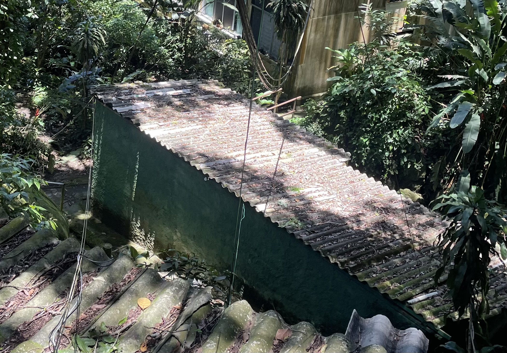
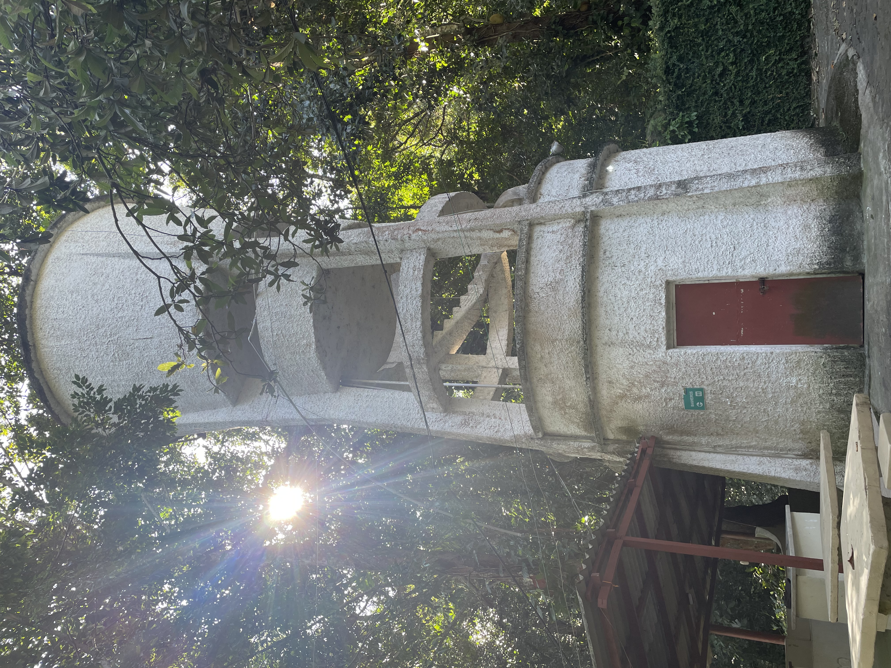
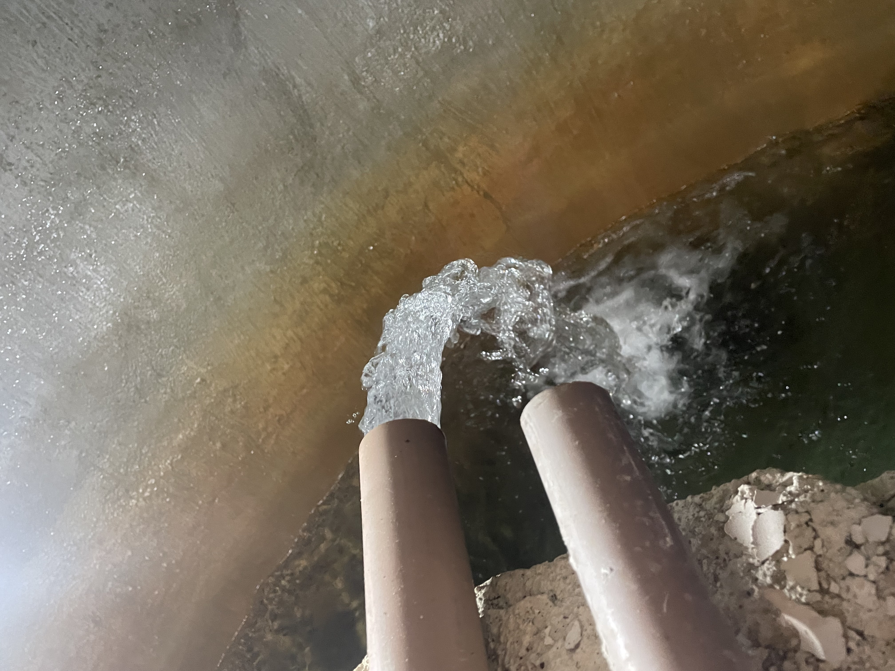
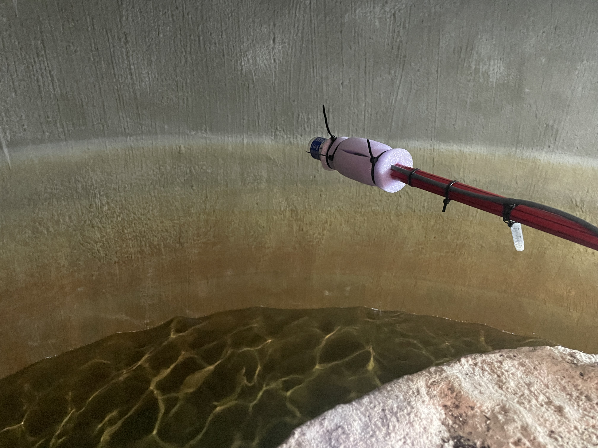
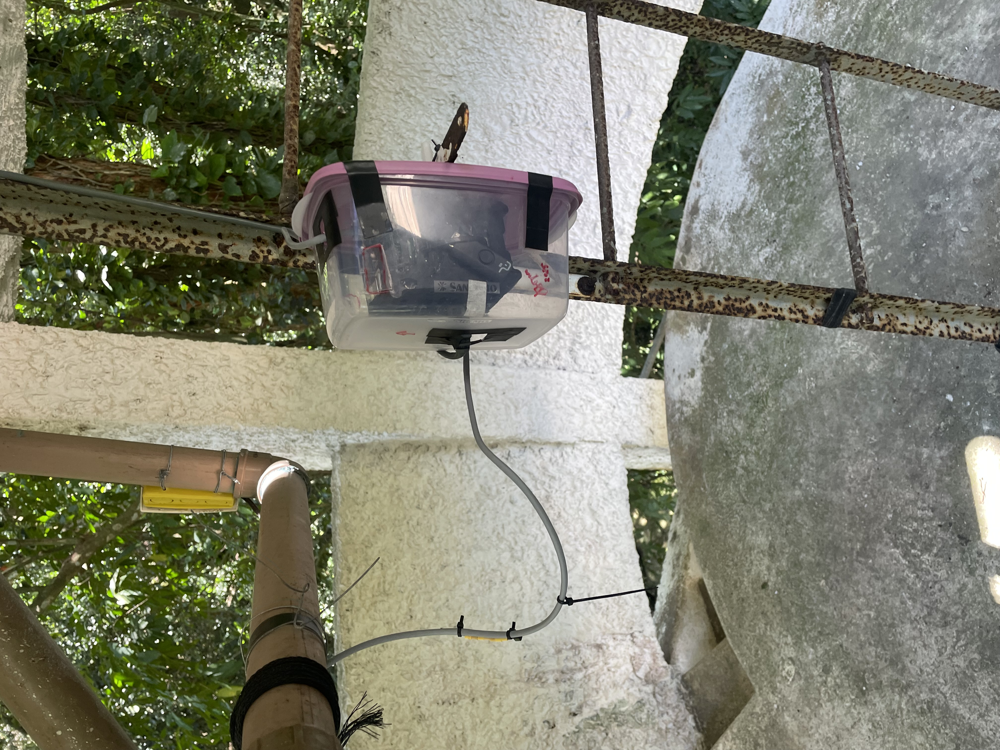
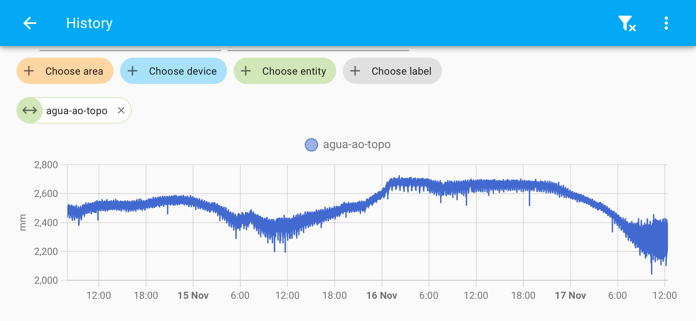

# Condomínio Residencial Recreio das Canoas
### Rede de Distribuição de Água
  
## Como mudar: água

O CRRC é privilegiado por ser um condomínio com 200 unidades residenciais que compartilham uma fonte de água natural, reconhecido por todos como "nosso poço".

Um volume dessa água subterrânea é ininterruptamente bombeado para outro portentoso cartão postal Canoense, o "nosso castelo".

É necessário que haja um sincronismo perfeito da mãe natureza com esse "nosso par de equipamentos" para que os encanamentos que alimentam as caixas dos "nossos blocos" mantenham o fornecimento d´água para "nossas casas".

A principal pergunta que fica é: **Como monitorar a nossa água?**

Tentando responder à [questão levantada](../agua.md), está sendo desenvolvido o projeto descrito a seguir.

## Como monitorar a água no Castelo Canoas?

A sigla IoT (Internet of Things) é bastante genérica e serve para identificar uma relação simbiótica entre computadores de todos os tamanhos, sobretudo os menores, e as redes de comunicação, desde redes locais até a vastidão da Internet.

Um projeto batizado de *IoT Canoas* iniciou com a instalação de um sensor laser no castelo para medir o nível da água em tempo real. Isso significa que poderemos monitorar a água no castelo. Como mostra a figura abaixo, o sensor laser está medindo a distância entre o topo da caixa e a superfície da água. Ou seja, quanto maior a distância medida, mais baixo estará o nível da água na caixa do Castelo.

O sensor laser é conectado a um módulo contendo um micro computador, alimentado através do cabo da rede, usando a tecnologia PoE (Power over Ethernet). Com isso, não é necessário haver instalação elétrica, o cabo da rede basta para prover alimentação e comunicação ao módulo do microcomputador. Veja abaixo a sua instalação na base da escada de acesso ao topo do Castelo.

## Monitoramento do Castelo

Os primeiros resultados obtidos após as instalações do módulo microcomputador e do sensor laser estão apresentados a seguir. Cabe de novo ressaltar que as medidas obtidas em tempo real pelo sensor laser monitoram a distância da água ao **topo** da caixa. Quanto **maior** o valor medido, **menor** é o nível da água na caixa.

## Mais informações

- Para quem se interessar em saber mais, favor consultar a referência técnica no [repositório iot-tofu](https://github.com/josemotta/iot-tofu) que mostra fases da construção e testes do [sensor laser](https://github.com/josemotta/iot-tofu/tree/main/rpi/vl53l1x/ha#readme).

- A continuidade do desenvolvimento do projeto irá converter as medidas em números mais naturais, mostrando o nível da água, por exemplo. Para isso, são necessários trabalhos adicionais de medição do Castelo em si, como a altura total da caixa d´água.

- Tendo em vista o período experimental inicial de testes e desenvolvimento, os equipamentos estão sendo instalados sem custo para o CRRC. Conta-se também com ajuda eventual dos funcionários para agilizar as instalações.

--------------------

Seguem algumas questões para discussão no grupo de trabalho, visando esse novo *workflow* proposto:

- Como financiar o projeto e a obra?
- Quais as etapas da elaboração do projeto e da contratação da respectiva obra?
- Haverá alguma orientação básica dos moradores para definir o tipo de projeto?
- Como o projeto irá afetar a vida de todos?
- Haverá um concurso de projetos que viabilizaria um debate sobre a melhor solução?
- Os proprietários devem poder participar na escolha do melhor projeto?
