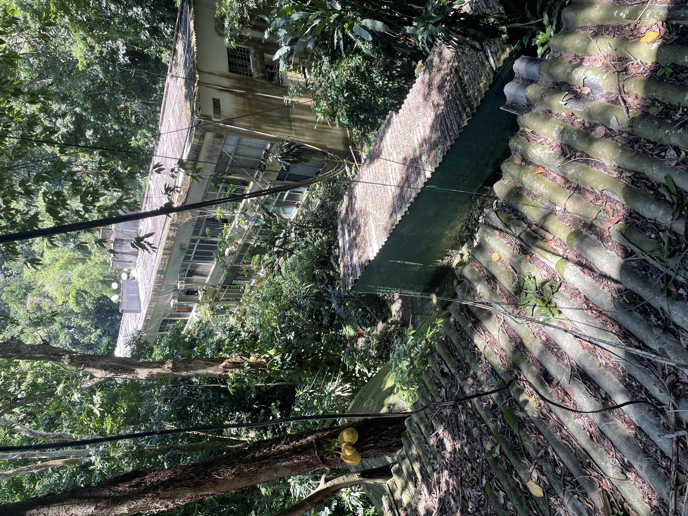

# Condomínio Residencial Recreio das Canoas
### Rede de Distribuição de Água
  
## Como mudar a água

O CRRC é privilegiado por ser um condomínio com 200 unidades residenciais que compartilham uma fonte de água natural, reconhecido por todos como "nosso poço".

Um volume dessa água subterrânea é ininterruptamente bombeado para outro portentoso cartão postal Canoense, o "nosso castelo".

É necessário que haja um sincronismo perfeito da mãe natureza com "nosso par" para que os encanamentos que alimentam as caixas dos "nossos blocos" mantenham o fornecimento d´água que utilizamos em "nossas casas".

A principal pergunta que surge é: **Como monitorar a água armazenada no castelo?**

Tentando responder à [questão levantada](../agua.md), está sendo desenvolvido o projeto IoT Canoas, descrito a seguir.

## IoT Canoas

A sigla IoT (Internet of Things) é bastante genérica e serve para identificar uma relação simbiótica entre computadores de todos os tamanhos, sobretudo os menores, e as redes de comunicação, desde redes locais até a vastidão da Internet.

Em nosso caso, o projeto *IoT Canoas* iniciou instalando um sensor laser no castelo para medir o nível da água em tempo real. Isso significa que poderemos monitorar a água no castelo.

O sensor laser é conectado através de um módulo contendo um micro computador.

Para quem se interessar, favor consultar a referência técnica do projeto [iot-tofu](https://github.com/josemotta/iot-tofu).

Tendo em vista o período experimental inicial de testes e desenvolvimento, os equipamentos estão sendo instalados sem custo para o CRRC. Conta-se também com ajuda eventual dos funcionários para agilizar as instalações.

--------------------

Seguem algumas questões para discussão no grupo de trabalho, visando esse novo *workflow* proposto:

- Como financiar o projeto e a obra?
- Quais as etapas da elaboração do projeto e da contratação da respectiva obra?
- Haverá alguma orientação básica dos moradores para definir o tipo de projeto?
- Como o projeto irá afetar a vida de todos?
- Haverá um concurso de projetos que viabilizaria um debate sobre a melhor solução?
- Os proprietários devem poder participar na escolha do melhor projeto?
