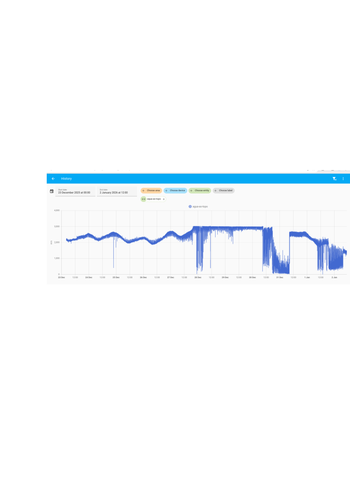
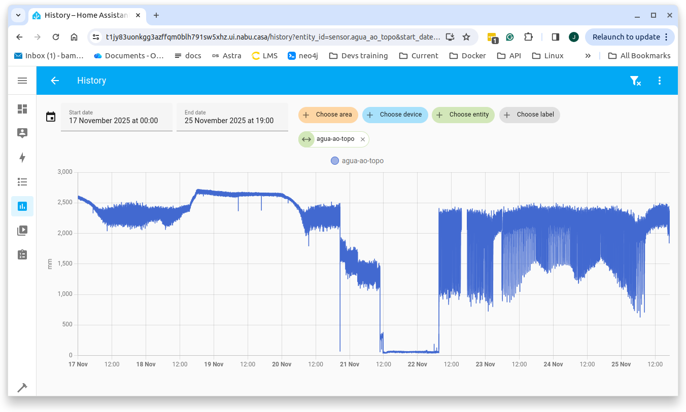
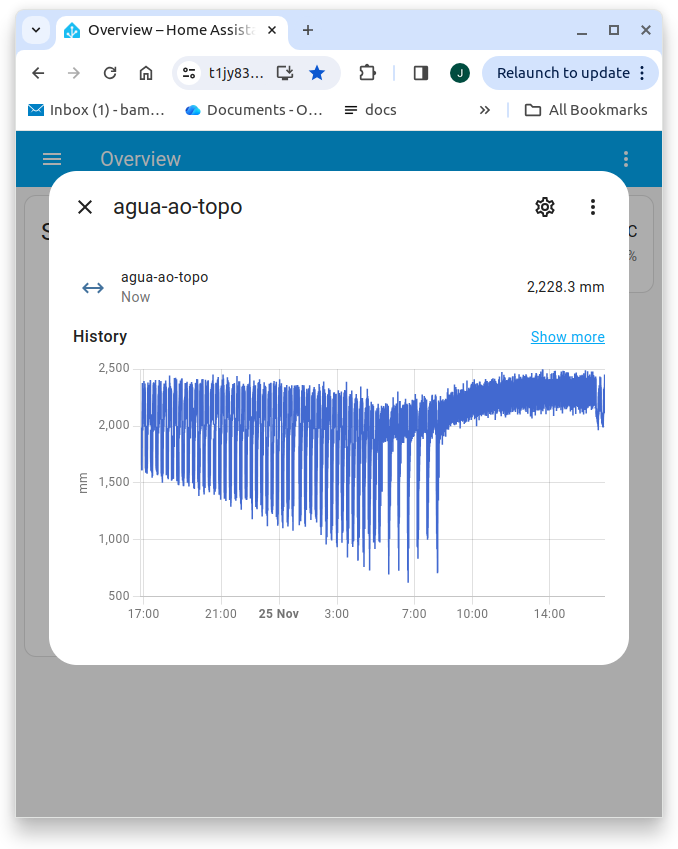

# Condomínio Residencial Recreio das Canoas
### Rede de Distribuição de Água

## histórico

Segue histórico do final de 2025, em que houve um período normal de abastecimento de água desde o poço, passando para o castelo e daí para as caixas dos blocos. Isso ocorreu até dia 28/12/2025.

A partir daí, vê-se que o consumo excedeu a capacidade do nosso poço, levando o valor de *agua-ao-topo* ao seu limite máximo de 3 metros. Com essa chegada ao *fundo do poço*, houve desabastecimento e a necessidade de uma operação manual dos funcionários para manter as caixas dos blocos abastecidas com água.  Felizmente, o ano de 2026 entrou com a operação do poço voltando ao normal, com abastecimento automático das caixas dos blocos.
  
## agua-ao-topo

Após duas semanas da [instalação do sensor laser no Castelo Canoas](./README.md) nos deparamos com uma forma dinâmica, porém precisa, e certamente inusitada de avaliação de nosso consumo de água. Essa medida foi batizada, por motivos óbvios, de **agua-ao-topo** e representa as medidas obtidas em tempo real pelo sensor laser que monitoram a distância da água ao **topo** da caixa. Quanto **maior** o valor medido, **menor** é o nível da água na caixa.

Repare que o nível da água desce durante o dia, pois a combinação de bombas do poço não dá conta do alto consumo. A recuperação vem à noite. Devido ao consumo menor de todos, o poço é capaz de reabastecer o Castelo. Nota-se que o nível da água volta a cair assim que se inicia a manhã de um novo dia. O monitoramento contínuo poderá nos ajudar a tomar as decisões a respeito da capacidade do nosso poço, bem como nos alertar em caso de situações críticas de abastecimento.

Como curiosidade, nos detalhes pode-se perceber que o sensor laser é preciso e rápido para registrar, através dos traços verticais no gráfico, as ondulações criadas pelo repentino jato de água após cada ciclo da bomba ligando para abastecer o Castelo. Com isso, podemos verificar que o alto consumo é indicado pela alta frequência de acionamento da bomba de reabastecimento que vem do poço.

A cada vez, é bombeado o volume de um pequeno tanque que temos ao lado do poço, ou seja, o volume constante termina quando acaba o tanque. Quantas vezes mais bombeamos, maior o consumo. Repare que à noite a frequência diminue.

Outra verificação interessante é a interferência "precisa" da luz do sol nas medidas do laser. O [agito da água na hora do bombeamento](./crrc-alimenta-castelo.jpg) deve gerar medidas das ondulações e respingos, creio. São traços verticais, de dia geralmente, creio que raios do sol interferem também, com reflexos nos respingos. São informações que precisam ser mais estudadas.

Outra área de investigação seria a introdução de alarmes de níveis muito baixos de água. Pode também identificar  transbordos iminentes, como os registrados no meio do gráfico. Repare que o valor de **agua-ao-topo** caiu quase a zero, foram registrados até 6 milímetros nesse período.
